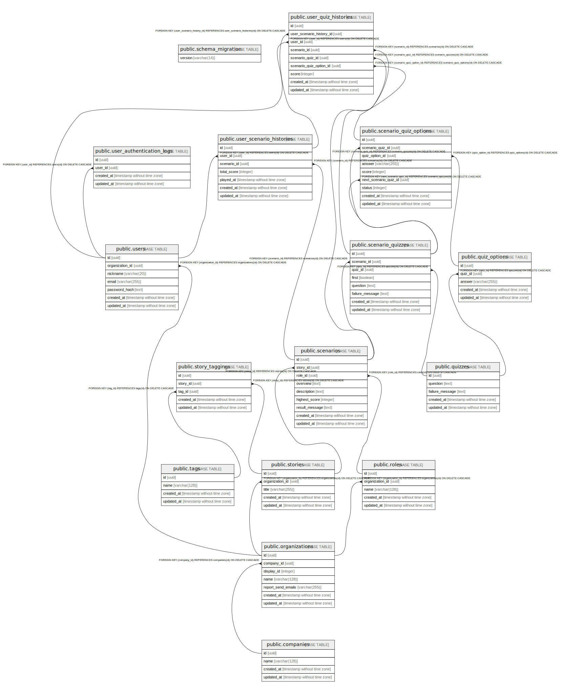

# play_security_development

## Tables

| Name | Columns | Comment | Type |
| ---- | ------- | ------- | ---- |
| [public.schema_migration](public.schema_migration.md) | 1 |  | BASE TABLE |
| [public.companies](public.companies.md) | 4 |  | BASE TABLE |
| [public.organizations](public.organizations.md) | 7 |  | BASE TABLE |
| [public.users](public.users.md) | 7 |  | BASE TABLE |
| [public.user_authentication_logs](public.user_authentication_logs.md) | 4 |  | BASE TABLE |
| [public.tags](public.tags.md) | 4 |  | BASE TABLE |
| [public.roles](public.roles.md) | 5 |  | BASE TABLE |
| [public.stories](public.stories.md) | 5 |  | BASE TABLE |
| [public.stories_tags](public.stories_tags.md) | 5 |  | BASE TABLE |
| [public.scenarios](public.scenarios.md) | 9 |  | BASE TABLE |
| [public.quizzes](public.quizzes.md) | 5 |  | BASE TABLE |
| [public.quiz_options](public.quiz_options.md) | 5 |  | BASE TABLE |
| [public.scenario_quizzes](public.scenario_quizzes.md) | 8 |  | BASE TABLE |
| [public.scenario_quiz_options](public.scenario_quiz_options.md) | 9 |  | BASE TABLE |
| [public.user_scenario_histories](public.user_scenario_histories.md) | 6 |  | BASE TABLE |
| [public.user_quiz_histories](public.user_quiz_histories.md) | 9 |  | BASE TABLE |

## Relations

---

> Generated by [tbls](https://github.com/k1LoW/tbls)
