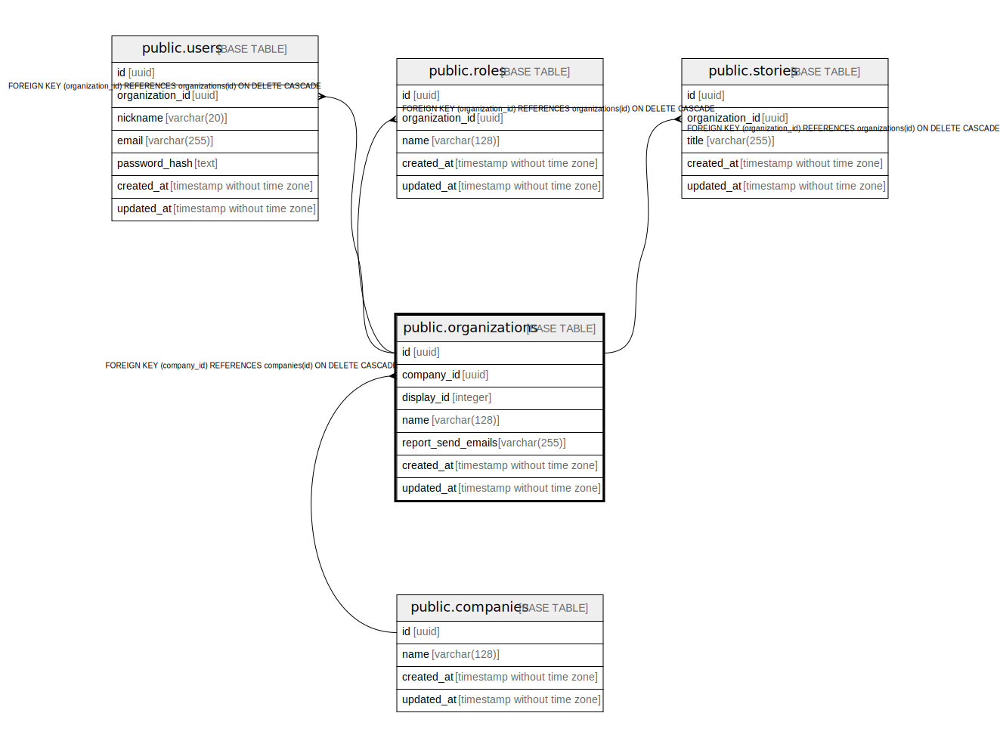

# public.organizations

## Description

## Columns

| Name | Type | Default | Nullable | Children | Parents | Comment |
| ---- | ---- | ------- | -------- | -------- | ------- | ------- |
| id | uuid | gen_random_uuid() | false | [public.users](public.users.md) [public.roles](public.roles.md) [public.scenarios](public.scenarios.md) |  |  |
| company_id | uuid |  | false |  | [public.companies](public.companies.md) |  |
| display_id | integer |  | false |  |  |  |
| name | varchar(128) |  | false |  |  |  |
| report_send_emails | varchar(255) |  | false |  |  |  |
| created_at | timestamp without time zone |  | false |  |  |  |
| updated_at | timestamp without time zone |  | false |  |  |  |

## Constraints

| Name | Type | Definition |
| ---- | ---- | ---------- |
| organizations_company_id_fkey | FOREIGN KEY | FOREIGN KEY (company_id) REFERENCES companies(id) ON DELETE CASCADE |
| organizations_pkey | PRIMARY KEY | PRIMARY KEY (id) |

## Indexes

| Name | Definition |
| ---- | ---------- |
| organizations_pkey | CREATE UNIQUE INDEX organizations_pkey ON public.organizations USING btree (id) |
| organizations_display_id_idx | CREATE UNIQUE INDEX organizations_display_id_idx ON public.organizations USING btree (display_id) |

## Relations

---

> Generated by [tbls](https://github.com/k1LoW/tbls)
