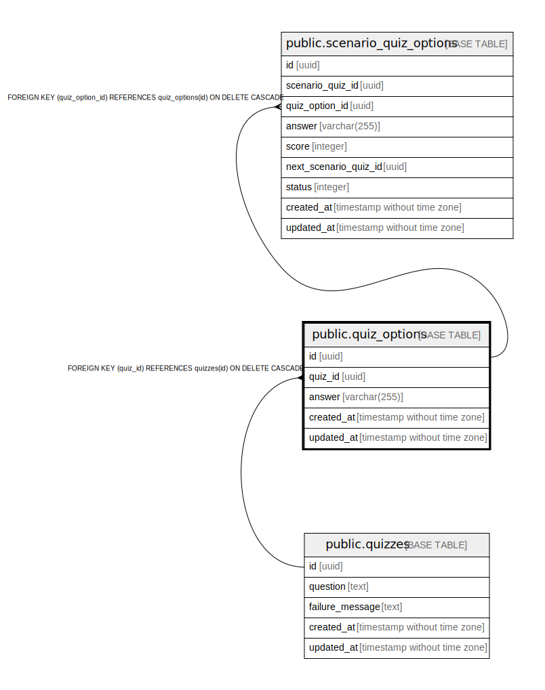

# public.quiz_options

## Description

## Columns

| Name | Type | Default | Nullable | Children | Parents | Comment |
| ---- | ---- | ------- | -------- | -------- | ------- | ------- |
| id | uuid | gen_random_uuid() | false | [public.user_scenario_quiz_histories](public.user_scenario_quiz_histories.md) |  |  |
| quiz_id | uuid |  | false |  | [public.quizzes](public.quizzes.md) |  |
| answer | varchar(255) |  | false |  |  |  |
| score | integer |  | false |  |  |  |
| next_quiz_id | uuid |  | true |  | [public.quizzes](public.quizzes.md) |  |
| next_status | integer |  | false |  |  |  |
| created_at | timestamp without time zone |  | false |  |  |  |
| updated_at | timestamp without time zone |  | false |  |  |  |

## Constraints

| Name | Type | Definition |
| ---- | ---- | ---------- |
| quiz_options_next_quiz_id_fkey | FOREIGN KEY | FOREIGN KEY (next_quiz_id) REFERENCES quizzes(id) ON DELETE CASCADE |
| quiz_options_quiz_id_fkey | FOREIGN KEY | FOREIGN KEY (quiz_id) REFERENCES quizzes(id) ON DELETE CASCADE |
| quiz_options_pkey | PRIMARY KEY | PRIMARY KEY (id) |

## Indexes

| Name | Definition |
| ---- | ---------- |
| quiz_options_pkey | CREATE UNIQUE INDEX quiz_options_pkey ON public.quiz_options USING btree (id) |

## Relations

---

> Generated by [tbls](https://github.com/k1LoW/tbls)
