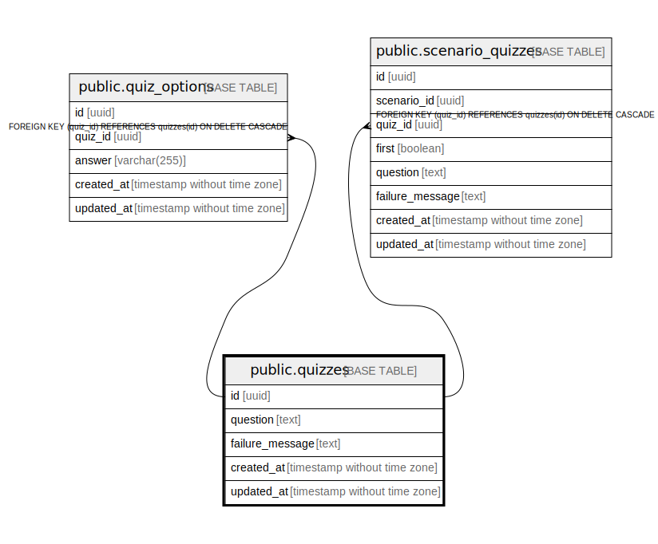

# public.quizzes

## Description

## Columns

| Name | Type | Default | Nullable | Children | Parents | Comment |
| ---- | ---- | ------- | -------- | -------- | ------- | ------- |
| id | uuid | gen_random_uuid() | false | [public.quiz_options](public.quiz_options.md) [public.user_scenario_quiz_histories](public.user_scenario_quiz_histories.md) |  |  |
| scenario_id | uuid |  | false |  | [public.scenarios](public.scenarios.md) |  |
| question | text |  | false |  |  |  |
| failure_message | text |  | true |  |  |  |
| created_at | timestamp without time zone |  | false |  |  |  |
| updated_at | timestamp without time zone |  | false |  |  |  |

## Constraints

| Name | Type | Definition |
| ---- | ---- | ---------- |
| quizzes_scenario_id_fkey | FOREIGN KEY | FOREIGN KEY (scenario_id) REFERENCES scenarios(id) ON DELETE CASCADE |
| quizzes_pkey | PRIMARY KEY | PRIMARY KEY (id) |

## Indexes

| Name | Definition |
| ---- | ---------- |
| quizzes_pkey | CREATE UNIQUE INDEX quizzes_pkey ON public.quizzes USING btree (id) |

## Relations

---

> Generated by [tbls](https://github.com/k1LoW/tbls)
