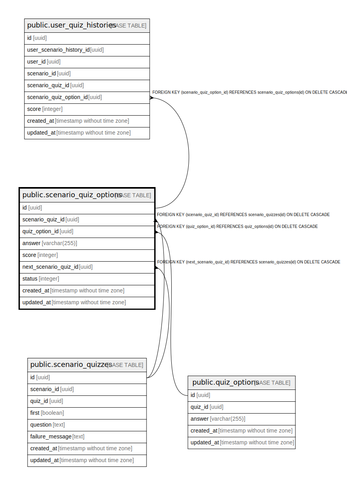

# public.scenario_quiz_options

## Description

## Columns

| Name | Type | Default | Nullable | Children | Parents | Comment |
| ---- | ---- | ------- | -------- | -------- | ------- | ------- |
| id | uuid | gen_random_uuid() | false | [public.user_quiz_histories](public.user_quiz_histories.md) |  |  |
| scenario_quiz_id | uuid |  | false |  | [public.scenario_quizzes](public.scenario_quizzes.md) |  |
| quiz_option_id | uuid |  | false |  | [public.quiz_options](public.quiz_options.md) |  |
| answer | varchar(255) |  | true |  |  |  |
| score | integer |  | false |  |  |  |
| next_scenario_quiz_id | uuid |  | true |  | [public.scenario_quizzes](public.scenario_quizzes.md) |  |
| status | integer |  | false |  |  |  |
| created_at | timestamp without time zone |  | false |  |  |  |
| updated_at | timestamp without time zone |  | false |  |  |  |

## Constraints

| Name | Type | Definition |
| ---- | ---- | ---------- |
| scenario_quiz_options_quiz_option_id_fkey | FOREIGN KEY | FOREIGN KEY (quiz_option_id) REFERENCES quiz_options(id) ON DELETE CASCADE |
| scenario_quiz_options_next_scenario_quiz_id_fkey | FOREIGN KEY | FOREIGN KEY (next_scenario_quiz_id) REFERENCES scenario_quizzes(id) ON DELETE CASCADE |
| scenario_quiz_options_scenario_quiz_id_fkey | FOREIGN KEY | FOREIGN KEY (scenario_quiz_id) REFERENCES scenario_quizzes(id) ON DELETE CASCADE |
| scenario_quiz_options_pkey | PRIMARY KEY | PRIMARY KEY (id) |

## Indexes

| Name | Definition |
| ---- | ---------- |
| scenario_quiz_options_pkey | CREATE UNIQUE INDEX scenario_quiz_options_pkey ON public.scenario_quiz_options USING btree (id) |

## Relations

---

> Generated by [tbls](https://github.com/k1LoW/tbls)
