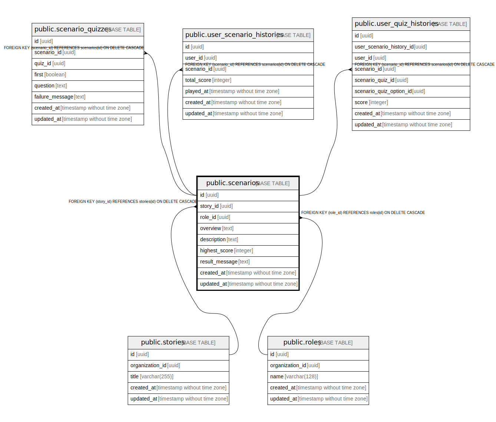

# public.scenarios

## Description

## Columns

| Name | Type | Default | Nullable | Children | Parents | Comment |
| ---- | ---- | ------- | -------- | -------- | ------- | ------- |
| id | uuid | gen_random_uuid() | false | [public.scenario_quizzes](public.scenario_quizzes.md) [public.user_scenario_histories](public.user_scenario_histories.md) [public.user_scenario_quiz_histories](public.user_scenario_quiz_histories.md) |  |  |
| organization_id | uuid |  | false |  | [public.organizations](public.organizations.md) |  |
| role_id | uuid |  | false |  | [public.roles](public.roles.md) |  |
| title | varchar(255) |  | false |  |  |  |
| overview | text |  | false |  |  |  |
| description | text |  | false |  |  |  |
| highest_score | integer |  | false |  |  |  |
| result_message | text |  | false |  |  |  |
| created_at | timestamp without time zone |  | false |  |  |  |
| updated_at | timestamp without time zone |  | false |  |  |  |

## Constraints

| Name | Type | Definition |
| ---- | ---- | ---------- |
| scenarios_organization_id_fkey | FOREIGN KEY | FOREIGN KEY (organization_id) REFERENCES organizations(id) ON DELETE CASCADE |
| scenarios_role_id_fkey | FOREIGN KEY | FOREIGN KEY (role_id) REFERENCES roles(id) ON DELETE CASCADE |
| scenarios_pkey | PRIMARY KEY | PRIMARY KEY (id) |

## Indexes

| Name | Definition |
| ---- | ---------- |
| scenarios_pkey | CREATE UNIQUE INDEX scenarios_pkey ON public.scenarios USING btree (id) |

## Relations

---

> Generated by [tbls](https://github.com/k1LoW/tbls)
