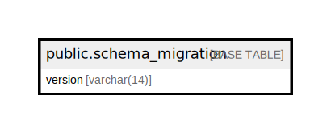

# public.schema_migration

## Description

## Columns

| Name | Type | Default | Nullable | Children | Parents | Comment |
| ---- | ---- | ------- | -------- | -------- | ------- | ------- |
| version | varchar(14) |  | false |  |  |  |

## Indexes

| Name | Definition |
| ---- | ---------- |
| schema_migration_version_idx | CREATE UNIQUE INDEX schema_migration_version_idx ON public.schema_migration USING btree (version) |

## Relations

---

> Generated by [tbls](https://github.com/k1LoW/tbls)
