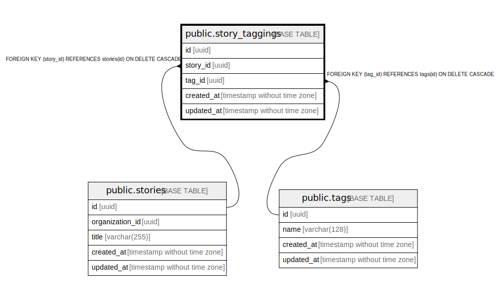

# public.story_taggings

## Description

## Columns

| Name | Type | Default | Nullable | Children | Parents | Comment |
| ---- | ---- | ------- | -------- | -------- | ------- | ------- |
| id | uuid | gen_random_uuid() | false |  |  |  |
| story_id | uuid |  | false |  | [public.stories](public.stories.md) |  |
| tag_id | uuid |  | false |  | [public.tags](public.tags.md) |  |
| created_at | timestamp without time zone |  | false |  |  |  |
| updated_at | timestamp without time zone |  | false |  |  |  |

## Constraints

| Name | Type | Definition |
| ---- | ---- | ---------- |
| story_taggings_tag_id_fkey | FOREIGN KEY | FOREIGN KEY (tag_id) REFERENCES tags(id) ON DELETE CASCADE |
| story_taggings_story_id_fkey | FOREIGN KEY | FOREIGN KEY (story_id) REFERENCES stories(id) ON DELETE CASCADE |
| story_taggings_pkey | PRIMARY KEY | PRIMARY KEY (id) |

## Indexes

| Name | Definition |
| ---- | ---------- |
| story_taggings_pkey | CREATE UNIQUE INDEX story_taggings_pkey ON public.story_taggings USING btree (id) |

## Relations

---

> Generated by [tbls](https://github.com/k1LoW/tbls)
