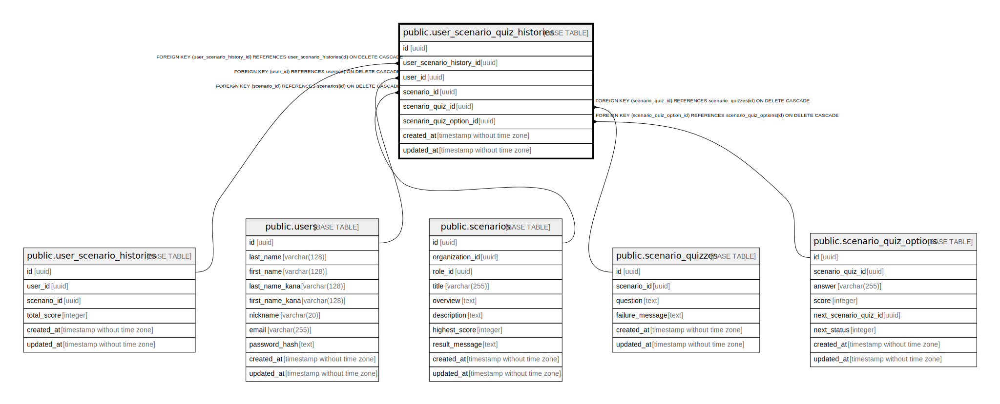

# public.user_scenario_quiz_histories

## Description

## Columns

| Name | Type | Default | Nullable | Children | Parents | Comment |
| ---- | ---- | ------- | -------- | -------- | ------- | ------- |
| id | uuid | gen_random_uuid() | false |  |  |  |
| user_scenario_history_id | uuid |  | false |  | [public.user_scenario_histories](public.user_scenario_histories.md) |  |
| user_id | uuid |  | false |  | [public.users](public.users.md) |  |
| scenario_id | uuid |  | false |  | [public.scenarios](public.scenarios.md) |  |
| quiz_id | uuid |  | false |  | [public.quizzes](public.quizzes.md) |  |
| quiz_option_id | uuid |  | false |  | [public.quiz_options](public.quiz_options.md) |  |
| score | integer |  | false |  |  |  |
| created_at | timestamp without time zone |  | false |  |  |  |
| updated_at | timestamp without time zone |  | false |  |  |  |

## Constraints

| Name | Type | Definition |
| ---- | ---- | ---------- |
| user_scenario_quiz_histories_user_id_fkey | FOREIGN KEY | FOREIGN KEY (user_id) REFERENCES users(id) ON DELETE CASCADE |
| user_scenario_quiz_histories_scenario_id_fkey | FOREIGN KEY | FOREIGN KEY (scenario_id) REFERENCES scenarios(id) ON DELETE CASCADE |
| user_scenario_quiz_histories_quiz_id_fkey | FOREIGN KEY | FOREIGN KEY (quiz_id) REFERENCES quizzes(id) ON DELETE CASCADE |
| user_scenario_quiz_histories_quiz_option_id_fkey | FOREIGN KEY | FOREIGN KEY (quiz_option_id) REFERENCES quiz_options(id) ON DELETE CASCADE |
| user_scenario_quiz_histories_user_scenario_history_id_fkey | FOREIGN KEY | FOREIGN KEY (user_scenario_history_id) REFERENCES user_scenario_histories(id) ON DELETE CASCADE |
| user_scenario_quiz_histories_pkey | PRIMARY KEY | PRIMARY KEY (id) |

## Indexes

| Name | Definition |
| ---- | ---------- |
| user_scenario_quiz_histories_pkey | CREATE UNIQUE INDEX user_scenario_quiz_histories_pkey ON public.user_scenario_quiz_histories USING btree (id) |

## Relations

---

> Generated by [tbls](https://github.com/k1LoW/tbls)
