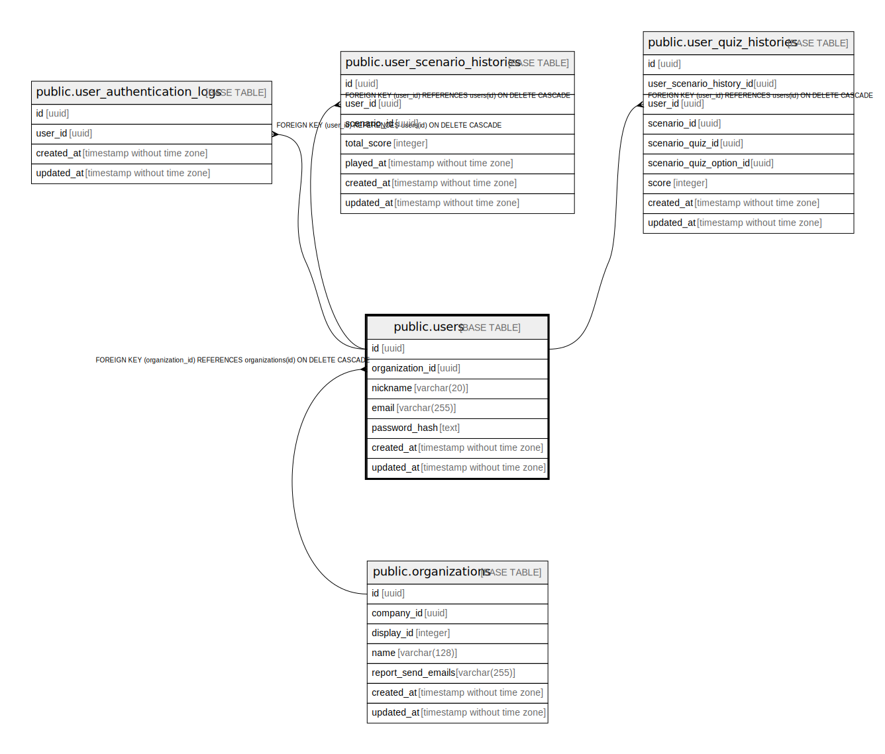

# public.users

## Description

## Columns

| Name | Type | Default | Nullable | Children | Parents | Comment |
| ---- | ---- | ------- | -------- | -------- | ------- | ------- |
| id | uuid | gen_random_uuid() | false | [public.user_organization_belonging](public.user_organization_belonging.md) [public.user_authentication_logs](public.user_authentication_logs.md) [public.user_scenario_histories](public.user_scenario_histories.md) [public.user_scenario_quiz_histories](public.user_scenario_quiz_histories.md) |  |  |
| last_name | varchar(128) |  | false |  |  |  |
| first_name | varchar(128) |  | false |  |  |  |
| last_name_kana | varchar(128) |  | false |  |  |  |
| first_name_kana | varchar(128) |  | false |  |  |  |
| nickname | varchar(20) |  | false |  |  |  |
| email | varchar(255) |  | false |  |  |  |
| password_hash | text |  | true |  |  |  |
| created_at | timestamp without time zone |  | false |  |  |  |
| updated_at | timestamp without time zone |  | false |  |  |  |

## Constraints

| Name | Type | Definition |
| ---- | ---- | ---------- |
| users_pkey | PRIMARY KEY | PRIMARY KEY (id) |

## Indexes

| Name | Definition |
| ---- | ---------- |
| users_pkey | CREATE UNIQUE INDEX users_pkey ON public.users USING btree (id) |

## Relations

---

> Generated by [tbls](https://github.com/k1LoW/tbls)
